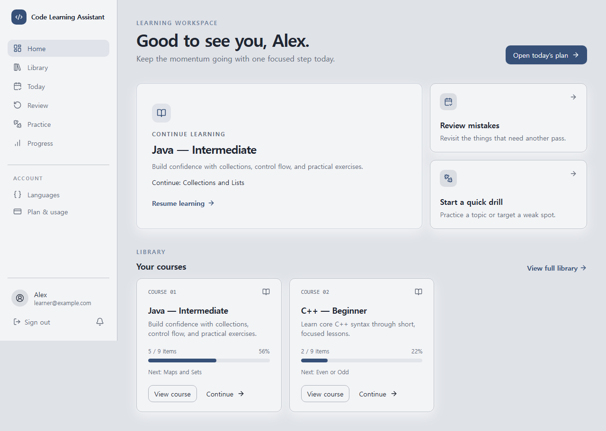
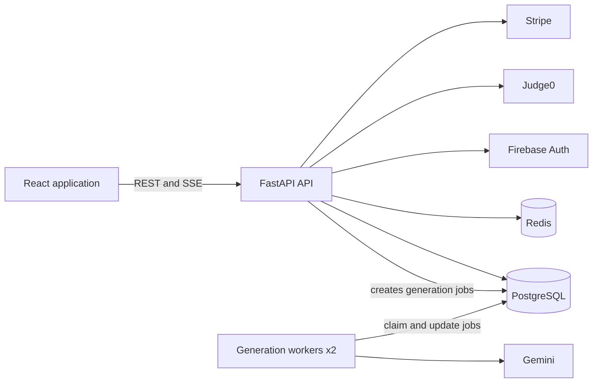

# Code Learning Assistant

[](https://github.com/Chiehling0214/Code-Learning-Assistant/actions/workflows/ci.yml)
[](https://code-learning-assistant.duckdns.org)

An AI-powered programming learning platform that turns a learner's current ability into a
personalized course of lessons, coding exercises, quizzes, and spaced review.

Instead of asking learners to choose their own level, Code Learning Assistant assesses their
answers and code, generates an appropriate curriculum, and keeps adapting the next step as they
progress.



## What it does

1. The learner chooses a programming language.
2. A placement test evaluates their current ability.
3. Gemini generates a personalized course at the assessed level.
4. The learner follows a focused daily plan of lessons, exercises, and quizzes.
5. Mistakes return through spaced review, while progress and topic mastery update over time.
6. Completing a course can generate the next three courses automatically.

## Key features

- **AI-assessed learning paths** — skill level is derived from placement and learning performance,
  not manually selected by the learner.
- **Personalized curricula** — background generation creates lessons, exercises, and quizzes for
  each language track.
- **Hands-on coding** — Monaco Editor, autosaved drafts, custom stdin, Judge0 execution, hidden-test
  grading, readable submission history, and attempt comparison.
- **AI Teacher and Tutor** — contextual lesson explanations, questions, and code hints without
  exposing the final answer.
- **Clear next steps** — the dashboard, daily plan, course page, and library keep reading a course
  separate from resuming the most recent learning activity.
- **Review and practice** — a mistakes notebook, spaced-review schedule, weak-topic filters, notes,
  and on-demand practice drills.
- **Progress tracking** — course completion, learning streaks, topic mastery, and the reasoning
  behind the assessed level.
- **Content controls** — learners can preview a focused lesson adjustment while preserving its
  topic and keep either the original or adjusted version.
- **Admin operations** — user-first content review, structured version comparison, content
  regeneration, learner reports, generation-job controls, usage data, and production monitoring.
- **Operational safeguards** — Firebase authentication, Redis-backed rate limiting, generation
  retries, request IDs, API/AI/frontend error tracking, and optional Stripe billing.

## Architecture



The API uses a layered architecture: route handlers depend on application services, services depend
on domain repository interfaces, and SQLAlchemy provides the infrastructure implementation. Long AI
generation tasks run across two dedicated worker replicas so API requests remain responsive and two
learners can generate curricula concurrently.

## Technology

| Area | Stack |
| --- | --- |
| Frontend | React 18, TypeScript, Vite, Tailwind CSS, TanStack Query, Zustand, Monaco Editor |
| Backend | FastAPI, Pydantic, SQLAlchemy 2, Alembic |
| Data | PostgreSQL 16, Redis 7 |
| AI | Google Gemini |
| Code execution | Judge0, hosted through RapidAPI or self-hosted |
| Authentication | Firebase Authentication |
| Billing | Stripe, optional |
| Infrastructure | Docker Compose, Caddy, GitHub Actions |
| Testing | Pytest, Ruff, ESLint, TypeScript, Playwright visual tests |

## Quick start with Docker

### Requirements

- Docker Desktop or Docker Engine with Docker Compose
- A Gemini API key for curriculum generation and AI assistance
- A Judge0 RapidAPI key, or the optional local Judge0 profile, for code execution

### 1. Clone and configure

```bash
git clone https://github.com/Chiehling0214/Code-Learning-Assistant.git
cd Code-Learning-Assistant
cp .env.example .env
```

On Windows PowerShell, replace the last command with:

```powershell
Copy-Item .env.example .env
```

The default configuration enables development authentication, so Firebase is not required for a
local UI/API smoke test. Add at least `GEMINI_API_KEY` to `.env` to use the personalized learning
flow. Add `JUDGE0_RAPIDAPI_KEY` to run and grade code through the hosted Judge0 service.

### 2. Start the application

```bash
docker compose up -d --build
```

The backend automatically runs database migrations and installs the supported language records.
Open:

- Application: <http://localhost:5173>
- API documentation: <http://localhost:8000/docs>
- Health check: <http://localhost:8000/health>

Check service status or follow logs with:

```bash
docker compose ps
docker compose logs -f backend worker
```

Stop the stack without deleting database data:

```bash
docker compose down
```

### Local Judge0 option

If a hosted Judge0 key is not configured, the repository includes an opt-in self-hosted profile:

```bash
docker compose --profile judge0 up -d --build
```

Judge0 requires privileged containers and may need additional host configuration. Without either
Judge0 option, the rest of the platform still starts, but code execution returns an unavailable
result.

## Configuration

Copy [.env.example](.env.example) and keep all real secrets in the untracked `.env` file.

| Capability | Main variables | Local default |
| --- | --- | --- |
| Authentication | `AUTH_STUB_ENABLED`, `FIREBASE_PROJECT_ID`, `FIREBASE_CREDENTIALS_*`, `VITE_FIREBASE_*` | Development stub enabled |
| AI | `GEMINI_API_KEY`, `GEMINI_MODEL`, `GEMINI_TEACHER_MODEL` | Disabled without a key |
| Code execution | `JUDGE0_RAPIDAPI_KEY`, `JUDGE0_URL`, `JUDGE0_AUTH_TOKEN` | Local profile URL |
| Curriculum | `CURRICULUM_*` | Six lessons, two exercises per lesson, three quiz questions |
| Billing | `BILLING_ENABLED`, `STRIPE_*` | Disabled |
| Rate limiting | `RATE_LIMIT_ENABLED`, `RATE_LIMIT_PER_MINUTE`, `REDIS_URL` | Disabled; Redis still included |
| Monitoring | `MONITORING_ENABLED`, `MONITORING_RETENTION_DAYS` | Enabled with 30-day retention |

Never commit `.env`, Firebase service-account JSON files, Gemini keys, Judge0 keys, or Stripe
secrets.

## Admin access

Users are created on their first sign-in. After the intended admin has signed in once, promote the
account from the project root:

```bash
docker compose exec backend python -m scripts.set_admin admin@admin.com
```

To revoke access:

```bash
docker compose exec backend python -m scripts.set_admin admin@admin.com --revoke
```

The Admin page provides content review and version history, regeneration controls, learner reports,
generation-job recovery, usage summaries, and operational monitoring.

## Local development

Docker is the recommended setup because it supplies PostgreSQL, Redis, the API, worker, and frontend
together. For host-based development, start only the data services first:

```bash
docker compose up -d postgres redis
```

### Backend

```bash
cd backend
python -m venv .venv
```

Activate the environment:

```powershell
# Windows PowerShell
.venv\Scripts\Activate.ps1
```

```bash
# macOS or Linux
source .venv/bin/activate
```

Then install and start the API:

```bash
pip install -r requirements.txt
cp .env.example .env
alembic upgrade head
python -m app.infrastructure.db.bootstrap
uvicorn app.main:app --reload
```

Run `python -m app.worker` in a second backend terminal when testing curriculum generation.

### Frontend

```bash
cd frontend
npm install
cp .env.example .env
npm run dev
```

The frontend development server runs at <http://localhost:5173>.

## Testing

### Backend

```bash
cd backend
ruff check .
pytest -q
```

### Frontend

```bash
cd frontend
npm run lint
npm run build
```

### Browser and visual regression tests

```bash
cd e2e
npm install
npm run install-browsers
npm test
```

The Playwright suite uses deterministic API fixtures and committed screenshots to cover the primary
learner and admin workflows. See [e2e/README.md](e2e/README.md) for smoke-test and snapshot-update
instructions.

## Repository layout

```text
.
├── backend/
│   ├── app/
│   │   ├── api/             # FastAPI routes and dependency wiring
│   │   ├── application/     # Use cases and application services
│   │   ├── domain/          # Entities and repository interfaces
│   │   ├── infrastructure/  # SQLAlchemy, Redis, monitoring, worker adapters
│   │   └── schemas/         # API request and response models
│   ├── alembic/             # Database migrations
│   ├── scripts/             # Seed and admin utilities
│   └── tests/               # Backend test suite
├── frontend/
│   └── src/
│       ├── components/      # Shared UI and learning components
│       ├── features/        # API hooks grouped by feature
│       ├── pages/           # Route-level pages
│       └── lib/             # Authentication, API, SSE, and monitoring clients
├── e2e/                     # Playwright flows and visual snapshots
├── docs/                    # Product and technical documentation
├── deploy/                  # Caddy and backup configuration
├── docker-compose.yml       # Local stack
└── docker-compose.prod.yml  # Single-server production stack
```

## Production deployment

The production Compose stack serves the frontend and API through Caddy with automatic HTTPS, runs
AI generation in a dedicated worker, and persists PostgreSQL and Caddy data in named volumes.

```bash
cp .env.prod.example .env
# Fill in the domain and production credentials before starting.
docker compose -f docker-compose.prod.yml up -d --build
```

See [docs/08_DEPLOYMENT.md](docs/08_DEPLOYMENT.md) for the deployment, backup, rollback, Firebase,
and Stripe setup procedures.

## Documentation

| Document | Description |
| --- | --- |
| [Product requirements](docs/01_PRD.md) | Product goals, personas, and behavior |
| [Architecture](docs/02_ARCHITECTURE.md) | Application boundaries and system design |
| [Database](docs/03_DATABASE.md) | Schema, relationships, and migrations |
| [API](docs/04_API.md) | Endpoints and authentication behavior |
| [AI design](docs/05_AI.md) | Teacher, tutor, and generation design |
| [Frontend](docs/06_FRONTEND.md) | Routes, state, and component organization |
| [Backend](docs/07_BACKEND.md) | Services, repositories, and infrastructure |
| [Deployment](docs/08_DEPLOYMENT.md) | Production runbook |
| [Testing](docs/09_TESTING.md) | Test strategy and quality gates |

## License

Proprietary. All rights reserved.
